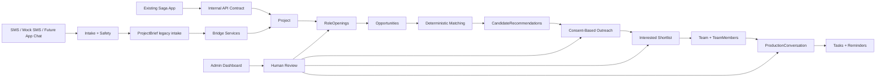

# Saga Production Network Architecture

Saga has one durable production loop:

`idea or existing project -> structured brief -> missing roles -> opportunities -> proximity/fandom matching -> consent-based outreach -> interested shortlist -> confirmed team -> production workflow -> outcome data`

## Layers

### Interface Layer

The interface layer receives messages or app actions and turns them into structured events for the production-network core.

- SMS: Twilio webhook routes and legacy `User`, `ProjectBrief`, `Contact`, `Outreach`, and `GroupChat` flows.
- Mock SMS: `MockMessagingProvider` and `/admin/dev` for no-provider demo testing.
- Admin dashboard: human review, editing, approvals, outreach, demo QA, and operational safety.
- Future app chat: should call the internal API or a future provider that implements the messaging interface.
- Future channels: Apple Messages for Business and WhatsApp can plug into the same provider boundary later.

### Production-Network Core

This is the canonical model layer for future Saga app integration.

- `Person`: channel-agnostic identity.
- `CreatorProfile`: creator supply profile, skills, fandoms, links, and review status.
- `Project`: canonical creative project or event production object.
- `RoleOpening`: missing staffing or collaboration need.
- `Opportunity`: surfaced gig, collaboration, or invite/apply object.
- `CandidateRecommendation`: deterministic match between a person and an
  opportunity, with admin review states for shortlist eligibility.
- `ShortlistPacket`: durable admin-reviewed draft packet for organizer-facing
  shortlist copy. Approval does not send the packet.
- `Team` and `TeamMember`: assembled production team.
- `ProductionConversation`: mock, Twilio, app chat, or future provider conversation attached to a project.

### Existing Saga App Integration Layer

The current mobile and desktop Saga apps are not connected yet. The new internal API defines the contract for them to sync data later:

- Existing app users become `Person` records by `sagaUserId`.
- Existing Saga events become `Project` records by `existingSagaEventId`.
- Existing communities become `existingSagaCommunityId` on projects and `communities` on creator profiles.
- Friend, mutual, community, attendance, follow, and collaboration data becomes `RelationshipEdge`.
- Ticketing, RSVPs, QR codes, event sales, and payments stay owned by the existing Saga app.

## Control Boundaries

The LLM can help write, extract, summarize, and suggest. It does not own state transitions, matching rank, outreach approval, booking, payment terms, legal terms, or group creation.

Human approval is required for external-facing outreach, shortlist packet
approval/sending, group chat creation, escalations, and any risky operational
topic. Shortlist packet approval is an internal gate only and does not contact
anyone.

## High-Level Flow

## Messaging Provider Boundary

`MessagingProvider` exposes:

- `sendMessage`
- `createGroupConversation`
- `addParticipant`
- `sendConversationMessage`
- `parseWebhook`
- `validateWebhook`

`MockMessagingProvider` is used by demo mode and does not require Twilio. `TwilioMessagingProvider` wraps the current Twilio SMS and Conversations code.

## What Is Canonical

For new work, engineers should treat the production-network models as canonical. Legacy SMS models should continue to work and bridge forward, but role openings, opportunities, recommendations, teams, and production conversations should be created against `Project` whenever possible.
