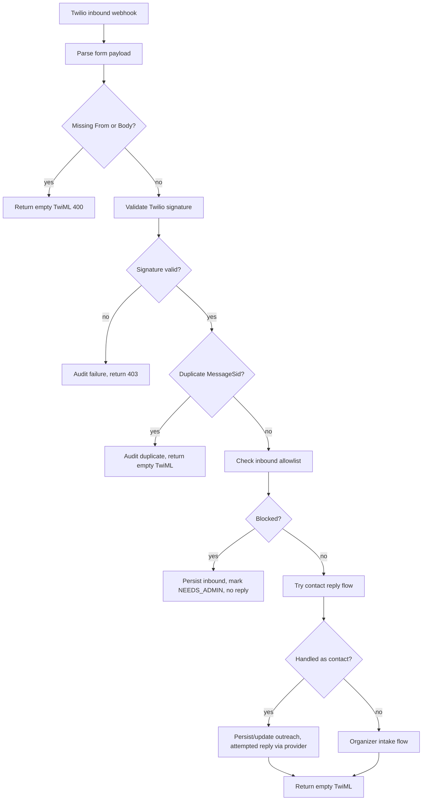
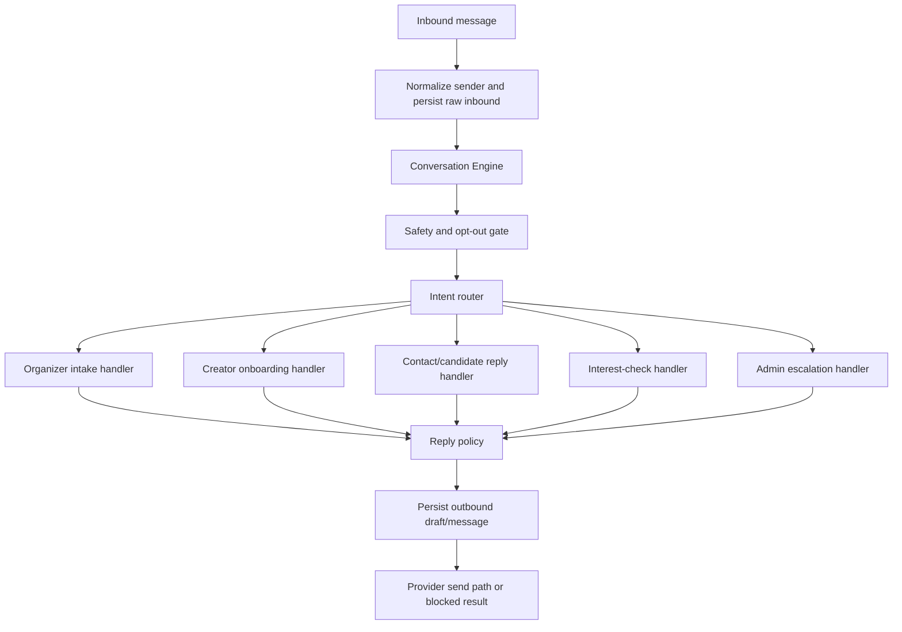
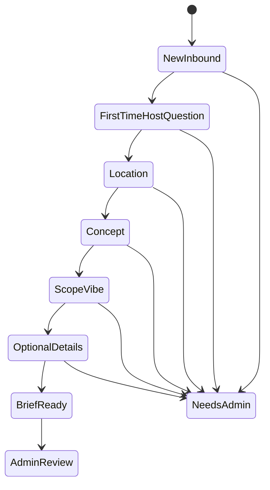
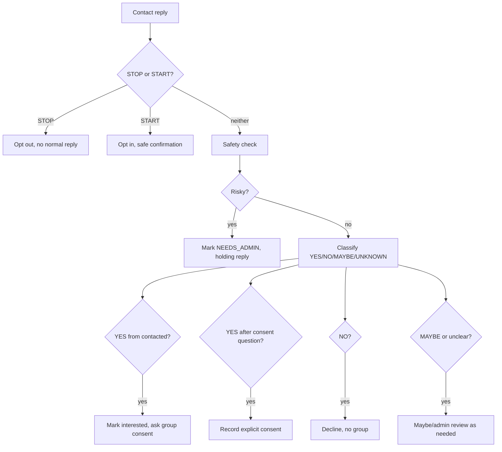

# Conversation Engine v0.1 Plan

This document audits the current Saga Producer MVP conversation system and proposes
a clean v0.1 Conversation Engine. It is a planning document only. It does not
enable live SMS, connect Twilio, connect the production Saga app, or change
ticketing, RSVP, QR, payment, event publishing, or production app data.

Conversation Engine v0.1 has now been consolidated. Use
`docs/conversation-engine-v0.1.md` as the engineer-facing source of truth for
the implemented v0.1 behavior, mode matrix, audit events, limitations, and next
milestones. This plan remains the phase-by-phase build history.

## Goals

The Conversation Engine should make Saga better at text conversations while
keeping the system structured, auditable, and human-approved.

Primary flows:

- Organizer/project-runner intake
- Gig-seeker/creator onboarding
- Contact/candidate replies
- Interest checks
- Admin override and escalation

Non-goals:

- Autonomous outreach
- Live SMS enablement
- Public launch
- Real Saga app integration
- Event publishing, ticketing, QR, RSVP, sales, payments, or production user
  permissions

## What Exists Today

### Inbound Routing

`src/app/api/twilio/inbound/route.ts` is the main inbound SMS webhook handler.
It currently:

- Parses Twilio form payloads.
- Records `sms.inbound_webhook_received` audit/log observations.
- Validates Twilio signatures through `validateTwilioWebhookRequest`.
- Rejects missing `From` or `Body`.
- Dedupes by Twilio MessageSid through `messageExistsForTwilioSid`.
- Applies SMS allowlist checks with `shouldBlockInboundSmsForAllowlist`.
- Escalates non-allowlisted inbound messages to `NEEDS_ADMIN`.
- Tries contact reply handling first through `handleContactInbound`.
- Falls back to organizer intake through `handleOrganizerInbound`.
- Returns empty TwiML only, never a TwiML `<Message>` reply.

This means the current inbound decision tree is:



### Message Persistence and Send Blocking

`src/lib/messages.ts` centralizes message persistence and outbound sends.

Current behavior:

- `createInboundMessage` persists inbound messages and upserts by Twilio SID.
- `sendSmsMessage` always stores outbound messages before attempting provider
  delivery.
- Provider sends flow through `getMessagingProvider`.
- `SMS_SENDS_DISABLED=true` is enforced in the Twilio provider path and stores a
  blocked outbound result instead of calling Twilio.
- Blocked sends are audited as `message.send_blocked`.
- Failed sends are persisted with failure metadata.

### LLM Functions

`src/lib/producerAgent.ts` provides structured LLM/fallback helpers:

- `generateIntakeReply(projectBrief, latestMessage, user)`
- `extractBriefFields(projectBrief, latestMessage)`
- `suggestRequiredRoles(projectBrief)`
- `draftOutreachMessage(projectBrief, contact)`
- `summarizeShortlist(projectBrief, interestedContacts)`
- `generateGroupChatKickoff(projectBrief, participants)`
- `suggestTasksFromGroupChat(projectBrief, recentMessages)`

Current safeguards:

- JSON outputs are validated with Zod.
- Missing OpenAI credentials fall back to deterministic logic.
- Invalid JSON, low confidence, or unsafe generated copy falls back.
- The system prompt forbids firm commitments about payment, bookings, legal
  terms, venue availability, revenue, attendance, permits, insurance, or
  confirmed team members.

### Organizer Intake

`src/lib/intake.ts` handles the organizer/project-runner path.

Current behavior:

- Normalizes the sender phone.
- Finds or creates a `User`.
- Finds or creates the latest active `ProjectBrief`.
- Handles STOP and START for local opt-out state.
- Persists every inbound organizer message.
- Applies rate limiting.
- Applies deterministic safety escalation through `assessMessageSafety`.
- Calls `extractBriefFields`.
- Uses `workflow.ts` to determine the next missing intake question.
- Updates `User.hasCompletedFirstTimeHostQuestion`.
- Moves the `ProjectBrief` to `BRIEF_READY_FOR_REVIEW` when all intake fields
  are present.
- Bridges the completed `ProjectBrief` to canonical `Project` through
  `ensureProjectForProjectBrief`.
- Sends the reply through `sendSmsMessage`, which can block real sends.

Important detail: the first-time host question is stored on `User`, so it can be
asked only once per phone number.

### Current Intake State Machine

`src/lib/workflow.ts` controls the intake field order:

1. First-time host question
2. City/location
3. Description/concept
4. Vibe/scope
5. Target date/timing
6. Budget range
7. Audience size
8. Help needed

`nextStatusAfterIntake` returns:

- `NEEDS_ADMIN` if already escalated
- `INTAKE_IN_PROGRESS` while fields are missing
- `BRIEF_READY_FOR_REVIEW` when intake is complete

`src/lib/workflowStateMachine.ts` adds transition validation for broader
project, outreach, candidate, interest check, conversation, team, and task
states.

### Contact Reply Flow

`src/lib/contactReplies.ts` handles legacy `Contact` + `Outreach` replies.

Current behavior:

- Finds active outreach by normalized contact phone.
- Handles STOP/START for contacts.
- Persists inbound contact replies.
- Applies contact rate limiting.
- Applies deterministic safety escalation.
- Classifies YES, NO, MAYBE, UNKNOWN deterministically.
- Moves `Outreach` status:
  - `SENT -> INTERESTED` for YES
  - `SENT -> NOT_INTERESTED` for NO
  - `SENT -> MAYBE` for MAYBE or unclear
  - `INTERESTED -> APPROVED_FOR_GROUPCHAT` only after explicit YES to consent
- Marks unclear replies for admin review.
- Sends a consent question before group chat.

### Demo Network Conversation Pieces

`src/lib/networkCore.ts` includes demo-only production-network flows:

- `handleCreatorOnboardingDemo`
- `extractCreatorOnboardingFields`
- `createInterestCheckFromForm`
- `addInterestToCheck`
- `convertInterestCheckToProject`
- `approveMockRecommendationOutreach`
- `simulateCandidateReply`
- `createMockTeamAndConversation`

Current creator onboarding is available through `/admin/dev`, not through the
Twilio inbound router. It can create/update `Person` and `CreatorProfile`, mark
profiles `PENDING_REVIEW`, and send mock replies.

Current interest checks are admin/demo-form driven, not free-text inbound
conversation driven.

### Safety and Escalation

`src/lib/safety.ts` applies deterministic escalation flags for:

- Money, contracts, deposits, payment disputes, pricing, rates, guarantees
- Permits, legal, insurance, compliance
- Security, medical, fire, weapons, crowd safety
- Alcohol, drugs, minors, sexual or explicit content
- Harassment, discrimination, illegal activity, abusive or spam-like behavior
- Contact disputes
- Guarantee requests for attendance, revenue, booking, venue access, celebrities,
  or influencers

Escalation reply:

> I want to make sure we handle that carefully. I'm going to flag this for a
> human on the Saga team and we'll follow up before moving forward.

### Audit Events

Relevant existing audit/log coverage includes:

- `sms.inbound_webhook_received`
- `sms.inbound_signature_passed`
- `sms.inbound_signature_failed`
- `sms.inbound_duplicate_skipped`
- `sms.inbound_allowlist_checked`
- `sms.inbound_blocked_allowlist`
- `sms.inbound_processed`
- `sms.inbound_failed`
- `message.inbound_persisted`
- `message.send_blocked`
- `message.sent`
- `message.send_failed`
- `project.created_from_sms`
- `project.intake_updated`
- `project.escalated`
- `project_brief.status_transitioned`
- `sms.opted_out`
- `sms.opted_in`
- `contact_reply.updated_outreach`
- `contact_reply.escalated`
- `contact_reply.needs_admin`
- `outreach.status_transitioned`
- `creator_profile.demo_onboarded`
- `candidate.status_transitioned`
- `interest_check.status_transitioned`

## Key Gaps

### 1. No Central Intent Router

Inbound routing currently checks contact replies first, then assumes organizer
intake. There is no central classifier for:

- Organizer project idea
- Gig-seeker / "I want gigs"
- Interest check / "I wish this existed"
- Contact/candidate reply
- HELP / support request
- Admin/risky/confusing message

This causes gig-seeker and interest-check texts to default into project intake
unless tested manually through `/admin/dev`.

### 2. Conversation State Is Implicit

State currently lives across:

- `ProjectBrief.status`
- missing `ProjectBrief` fields
- `User.hasCompletedFirstTimeHostQuestion`
- `Outreach.status`
- `Person` / `CreatorProfile`
- `CandidateRecommendation.status`
- `InterestCheck.status`
- message metadata

This is workable, but there is no explicit "current conversation flow" or
"expected next answer" object for a phone number.

### 3. Gig-Seeker Flow Is Demo-Only

`handleCreatorOnboardingDemo` exists, but the live inbound router never routes
to it. There is no production-path `handleCreatorInbound` equivalent.

### 4. Interest-Check Flow Is Demo/Form-Only

Interest checks can be created from admin/demo forms and converted to projects,
but there is no text conversation that structures a wish/idea into an
`InterestCheck`.

### 5. Out-of-Order Answers Are Fragile

The deterministic fallback extraction is mostly next-field driven. For example,
if the next missing field is city and the user sends date/budget/help-needed,
the fallback may put that answer into `city`. The LLM may do better, but fallback
mode is the staging baseline and must be reliable.

### 6. Next-Question Policy Is Too Linear

`workflow.ts` has a fixed intake order. It does not yet distinguish:

- Required fields
- Optional fields
- Enough-information threshold
- Follow-up needed because an answer was ambiguous
- User explicitly saying "unknown" or "not sure"

### 7. Prompt/Tone Controls Are Centralized but Thin

`producerAgent.ts` has a good base system prompt. It does not yet have
flow-specific tone contracts, reusable no-promise clauses, or examples for
organizer, gig-seeker, contact, and interest-check replies.

### 8. Admin Review Points Are Present but Not Uniform

Organizer and contact safety paths can set `NEEDS_ADMIN`, but the demo creator
and interest-check flows do not share one consistent conversation-level
escalation path.

### 9. Evals Cover Good Foundations but Not Multi-Turn Policy

Existing tests cover fallback extraction, role mapping, unsafe messages,
contact YES/NO/MAYBE, creator field extraction, and shortlist safety. Missing:

- Multi-turn organizer intake with out-of-order answers
- First-time-host question across multiple projects for one phone
- Gig-seeker routing from inbound text
- Interest-check routing from inbound text
- HELP behavior
- Conversation state persistence
- Admin escalation from each flow
- Prompt regression examples by flow

## Proposed Architecture

Add a thin orchestration layer rather than replacing existing services.

Implemented conversation module:

- `src/lib/conversation/*`

Key supporting files:

- `src/lib/conversation/intentRouter.ts`
- `src/lib/conversation/conversationContext.ts`
- `src/lib/conversation/conversationTypes.ts`
- `src/lib/conversation/conversationEngineMode.ts`
- flow-specific policy and reply generator files
- `scripts/test-conversation-*.ts`

The engine should coordinate existing services:



## Phase 1 Status: Deterministic Intent Router in Shadow Mode

Implemented in Phase 1:

- `src/lib/conversation/conversationTypes.ts`
- `src/lib/conversation/intentRouter.ts`
- `src/lib/conversation/conversationContext.ts`
- `scripts/test-conversation-intent-router.ts`
- `npm run test:conversation-intent-router`

The router currently classifies inbound copy into this taxonomy:

- `ORGANIZER_PROJECT_IDEA`
- `GIG_SEEKER_ONBOARDING`
- `CONTACT_REPLY`
- `INTEREST_CHECK`
- `STOP_OR_OPT_OUT`
- `START_OR_OPT_IN`
- `HELP`
- `SAFETY_ESCALATION`
- `UNKNOWN`

The router result is structured and Zod-validated:

```ts
{
  intent: ConversationIntent;
  confidence: number;
  reasons: string[];
  matchedSignals: string[];
  shouldEscalate: boolean;
  suggestedFlow: ConversationFlow;
}
```

Shadow-mode behavior:

- `/api/twilio/inbound` loads read-only conversation context after signature,
  idempotency, and allowlist gates.
- It classifies the message and writes `conversation.intent_classified` to
  structured logs and `AuditLog`.
- The audit metadata includes the intent, confidence, reasons, matched signals,
  suggested flow, provider mode, redacted sender, MessageSid, and context booleans.
- It does not change routing.
- It does not change reply generation.
- It does not change outbound behavior.
- Gig-seeker and interest-check texts are still handled by the existing flow for
  now.

Deterministic routing rules in Phase 1:

1. STOP/STOPALL/UNSUBSCRIBE/CANCEL/END/QUIT -> `STOP_OR_OPT_OUT`
2. START/UNSTOP -> `START_OR_OPT_IN`
3. HELP/support/help me -> `HELP`
4. Safety/legal/money/logistics/minors/alcohol/weapons/harassment/
   discrimination/explicit/guarantee language -> `SAFETY_ESCALATION`
5. Known contact or active outreach context plus YES/NO/MAYBE/unclear reply
   language -> `CONTACT_REPLY`
6. Creator/gig language such as "I want gigs", "book me", "I'm a
   photographer", "I'm a cosplayer", "I'm a DJ", or "paid maid cafe gigs" ->
   `GIG_SEEKER_ONBOARDING`
7. Demand/interest language such as "I wish someone would", "would people come",
   "interest check", or "if enough people" -> `INTEREST_CHECK`
8. Event/project creation language such as "throw", "host", "produce",
   "pop-up", "meetup", "photoshoot", "activation" -> `ORGANIZER_PROJECT_IDEA`
9. Otherwise -> `UNKNOWN`

Important nuance: self-directed creator phrases like "looking for paid gigs" are
treated as onboarding rather than safety escalation, while rate, contract,
deposit, payment dispute, guarantee, and booking-commitment questions still
escalate.

Next planned phase: organizer intake policy refactor. The router should remain
shadow-only until the intake policy can handle out-of-order answers and
"enough information" thresholds reliably.

## Phase 2 Status: Conversation Context + Organizer Intake Policy

Phase 2 is implemented as a deterministic policy layer with shadow-mode audit
visibility. It is intentionally conservative: the existing organizer intake
handler still owns persistence and live Twilio replies. Applied replies are
limited to `CONVERSATION_ENGINE_MODE=mock_active` in MOCK/admin simulation.

Implemented files:

- `src/lib/conversation/conversationTypes.ts`
- `src/lib/conversation/conversationContext.ts`
- `src/lib/conversation/organizerIntakePolicy.ts`
- `scripts/test-conversation-organizer-policy.ts`

### Phase 2 Context Loader

`loadConversationContext(phone, options)` is read-only. It assembles:

- normalized phone for internal use only
- `User`
- `Person`
- `Contact`
- active `ProjectBrief`
- linked canonical `Project`
- active `Outreach`
- recent `Message` rows
- opt-out state
- first-time-host completion state
- provider/safety mode
- known organizer brief fields
- missing required and optional fields
- current organizer intake stage

The loader does not create records, does not send messages, and does not log raw
phone numbers. Audit callers must use redacted display values.

### Phase 2 ReplyPlan

The organizer policy returns a Zod-validated `ReplyPlan`:

```ts
{
  flow: "ORGANIZER_INTAKE" | "ADMIN_REVIEW" | "UNKNOWN";
  stage: OrganizerIntakeStage;
  nextStage: OrganizerIntakeStage;
  enoughInfoForBrief: boolean;
  shouldEscalate: boolean;
  escalationReason?: string;
  nextQuestion?: string;
  replyTone: string;
  allowedActions: string[];
  blockedActions: string[];
  explanationForAudit: string;
  confidence: number;
}
```

The policy also exposes an evaluation helper that returns the projected known
fields and missing-field lists used in audit metadata.

### Organizer Intake Policy

The deterministic policy:

1. Merges existing `ProjectBrief`/`Project` fields with the latest inbound text.
2. Handles out-of-order answers such as budget before city.
3. Recognizes multi-field messages such as city + concept + timing.
4. Asks the first-time-host question only when it has not been completed or
   already asked.
5. Asks one next question at a time.
6. Treats timing, budget, audience size, and help needed as useful but optional.
7. Marks `BRIEF_READY` only after concept, city, and scope/vibe are known and
   the first-time-host gate has been satisfied.
8. Escalates money/legal/contract/permitting/alcohol/security/minors/weapons/
   harassment/discrimination/explicit/guarantee language to `NEEDS_ADMIN`.
9. Never allows the AI/backend plan to promise bookings, payments, revenue,
   attendance, venue access, confirmed team members, celebrity participation,
   influencer participation, or autonomous outreach.

Budget statements like "budget is probably $5k" are treated as normal intake
data. Payment terms, rates, contracts, deposits, revenue, guarantees, and
booking commitments still escalate.

### Shadow-Mode Integration

`/api/twilio/inbound` now audits organizer reply planning after Phase 1 intent
classification for organizer idea messages and active organizer-intake
continuations:

- `conversation.intent_classified`
- `conversation.reply_plan_shadowed`

The reply-plan audit event includes flow, stage, next stage, enough-info state,
missing required fields, missing optional fields, next question, escalation
state, confidence, provider mode, redacted sender, and MessageSid.

Default behavior:

- `CONVERSATION_ENGINE_MODE=shadow`
- `CONVERSATION_ENGINE_ACTIVE=false`
- existing organizer intake replies remain unchanged
- no live SMS behavior changes
- `SMS_SENDS_DISABLED` continues to block Twilio outbound sends

If `CONVERSATION_ENGINE_MODE=mock_active`, the new organizer `ReplyPlan` may
drive the next organizer intake question only in MOCK/admin simulation. Twilio
staging remains shadow-only.

### Phase 2 Tests

`npm run test:conversation-organizer-policy` covers 40+ deterministic fixtures:

- clear organizer ideas
- vague ideas
- first-time and experienced host answers
- multi-field and out-of-order answers
- budget/audience/timing/help optional fields
- city changes
- repeated first-time-host protection
- unsafe/high-risk escalation
- no Twilio, DB, OpenAI, or live SMS required

Next planned phase: activate organizer intake in mock mode first, then add the
gig-seeker onboarding policy.

## Phase 3 Status: Mock-Active Organizer Intake

Phase 3 activates the organizer conversation engine only for MOCK/admin
simulation. Twilio staging remains shadow-only.

### Reply Modes

The conversation engine now has an explicit mode:

- `CONVERSATION_ENGINE_MODE=shadow` is the default. The router and ReplyPlan run
  and write audit events, but existing reply behavior remains the source of
  truth.
- `CONVERSATION_ENGINE_MODE=mock_active` allows the organizer ReplyPlan to drive
  the actual reply only when the provider is `MOCK` or the source is the admin
  dev simulation.

Legacy `CONVERSATION_ENGINE_ACTIVE=true` is treated as `mock_active` for
compatibility, but the effective activation still fails closed unless the
provider/source is safe.

`/api/health` reports:

- `app.conversationEngineMode`
- `app.conversationEngineActive`
- `app.conversationEngineEffectiveActive`
- `app.conversationEngineActiveAllowed`

No secrets or allowlisted phone numbers are exposed.

### Twilio Remains Shadow-Only

`/api/twilio/inbound` continues to run:

- `conversation.intent_classified`
- `conversation.reply_plan_shadowed`

It does not use the new generator for live Twilio replies. If an environment
attempts `mock_active` with `MESSAGING_PROVIDER=TWILIO`, the route writes
`conversation.engine_active_blocked_for_provider` and keeps the existing
shadow-only behavior. `SMS_SENDS_DISABLED` still blocks outbound provider sends.

### Organizer Reply Generator

`src/lib/conversation/organizerReplyGenerator.ts` converts a `ReplyPlan` into a
validated deterministic reply:

- `ask_next_question`
- `brief_ready`
- `needs_admin`
- `fallback`

Rules:

- ask one clear question at a time
- keep the tone warm, casual, and producer-like
- use the safe holding reply for escalations
- use the brief-ready reply when enough required info is present
- never promise bookings, payments, revenue, attendance, venue access, confirmed
  team members, celebrity participation, influencer participation, or guaranteed
  paid work

When the admin dev simulation applies the ReplyPlan, `handleOrganizerInbound`
writes `conversation.reply_plan_applied` with flow, stage, next stage, reply
type, source, enough-info state, missing fields, confidence, and redacted sender.

### Admin Dev Behavior

`/admin/dev` organizer intake defaults to `mock_active` for the fake organizer
simulation only. The page shows a compact debug panel with:

- selected engine mode
- effective active/shadow state
- latest ReplyPlan event
- flow
- stage and next stage
- missing required fields
- missing optional fields
- enough-info state
- generated reply source

This does not configure Twilio, send SMS, or connect the real Saga app.

### Phase 3 Tests

`npm run test:conversation-organizer-multiturn` covers:

- sparse opener
- event idea with city
- first-time-host answer
- city + concept + timing in one message
- enough-info brief readiness
- out-of-order budget answer
- location changes
- safety escalations
- off-topic messages
- first-time-host not asked twice
- Twilio fail-closed mode semantics

## Phase 4 Status: Gig-Seeker Onboarding Shadow Policy

Phase 4 adds a deterministic creator/gig-seeker onboarding policy, but keeps it
shadow-only. It does not change live Twilio reply behavior and does not create
live `CreatorProfile` records from Twilio inbound messages.

### Gig-Seeker Stages

The new `GigSeekerOnboardingStage` values are:

- `NEW`
- `ASK_LOCATION`
- `ASK_GIG_TYPES`
- `ASK_SKILLS`
- `ASK_FANDOMS`
- `ASK_LINKS`
- `ASK_AVAILABILITY`
- `PROFILE_READY_FOR_REVIEW`
- `NEEDS_ADMIN`

### Known Fields

The policy tracks:

- city/location
- desired roles or gig types
- skills
- fandoms, scenes, and communities
- portfolio URLs and social URLs
- availability notes
- rate notes
- compensation preference: `paid_only`, `paid_or_collab`,
  `volunteer_collab`, or `unknown`
- preferred opportunity types
- self-description
- safety flags

Required fields for profile review are city/location, desired roles or gig
types, and either a portfolio/social link or enough self-description to support
human review. Skills, fandoms/scenes, availability, rate notes, and compensation
preference remain useful optional fields. The policy may still ask for fandoms
before marking the profile ready because cultural/community fit is central to
Saga matching.

### ReplyPlan Behavior

`src/lib/conversation/gigSeekerOnboardingPolicy.ts` accepts a
`ConversationContext` and latest message, merges inferred fields with existing
read-only context, and returns a validated `ReplyPlan` with:

- `flow: "GIG_SEEKER_ONBOARDING"`
- current stage and next stage
- missing required and optional fields
- a single next question where needed
- `enoughInfoForProfileReview`
- escalation state and reason
- allowed and blocked actions
- audit explanation and confidence

The policy is deterministic and does not require OpenAI, Twilio, Railway, or a
database in tests.

### Shadow Integration

`/api/twilio/inbound` now runs the gig-seeker policy when the deterministic
intent router classifies `GIG_SEEKER_ONBOARDING`. It writes:

- `conversation.gig_seeker_reply_plan_shadowed`

The audit metadata includes flow, stage, next stage, missing fields, next
question, profile-review readiness, escalation state, confidence, provider mode,
redacted sender, and `shadowMode: true`.

This event is observational only. Twilio staging remains shadow-only and
`SMS_SENDS_DISABLED` continues to block provider sends. The route does not use
the gig-seeker policy to send live replies, and it does not create or update
`CreatorProfile` records from live Twilio inbound.

### Admin Dev Visibility

`/admin/dev` keeps the existing mock creator onboarding simulator. It now also
records and displays the latest gig-seeker shadow ReplyPlan so operators can
inspect:

- classified intent
- stage and next stage
- missing required fields
- missing optional fields
- next question
- profile-review readiness

This is admin/mock visibility only and does not activate live Twilio behavior.

### Phase 4 Tests

`npm run test:conversation-gig-seeker-policy` covers 40+ deterministic fixtures:

- generic gig-seeker messages
- paid cosplay/gig language without escalating normal self-directed preferences
- photographer, videographer, cosplayer, DJ, illustrator, designer, host,
  vendor, volunteer, venue owner, and production assistant roles
- out-of-order city, role, fandom, link, and self-description answers
- profile-review readiness
- safety escalation for guaranteed work, money, contracts, permits, minors,
  explicit content, harassment, discrimination, weapons, and unsafe/illegal
  activity
- no Twilio, DB, OpenAI, or live SMS required

## Phase 5 Status: Mock-Active Gig-Seeker Onboarding

Phase 5 activates the gig-seeker conversation engine for mock/admin simulation
only. Twilio staging remains shadow-only and live Twilio inbound does not create
or update `CreatorProfile` records.

### Mode Semantics

The existing conversation mode still applies:

- `CONVERSATION_ENGINE_MODE=shadow`: classify, plan, and audit only.
- `CONVERSATION_ENGINE_MODE=mock_active`: organizer and gig-seeker plans may
  drive replies only in MOCK/admin simulation.

If `MESSAGING_PROVIDER=TWILIO` tries to use `mock_active` from a Twilio webhook,
the engine fails closed to shadow behavior and writes
`conversation.engine_active_blocked_for_provider`. This protects the Twilio
staging pilot while `SMS_SENDS_DISABLED` remains true.

### Gig-Seeker Reply Generator

`src/lib/conversation/gigSeekerReplyGenerator.ts` converts a gig-seeker
`ReplyPlan` into a deterministic reply:

- `ask_next_question`
- `profile_ready_for_review`
- `needs_admin`
- `fallback`

It asks one question at a time, uses the safe Saga-team holding reply for
escalations, and uses the profile-ready reply only when enough creator
onboarding info is present. It filters out replies that would promise bookings,
paid work, placement, income, revenue, or guaranteed opportunities.

### Pending CreatorProfile Behavior

In mock/admin mode only, the admin dev creator simulator can apply the
gig-seeker ReplyPlan and create or update a pending `CreatorProfile`.

The profile preparation step:

- upserts a mock/admin `Person` from the simulated phone
- merges confidently known city, desired roles, skills, fandoms, communities,
  portfolio/social links, availability notes, rate notes, and preferred
  opportunity types
- sets `reviewStatus` to `PENDING_REVIEW` unless the existing profile is already
  `APPROVED` or `REJECTED`
- writes `conversation.gig_seeker_profile_prepared`

It does not approve profiles automatically and does not run for live Twilio
inbound.

### Admin Dev Behavior

`/admin/dev` now shows mock-active status for creator onboarding and displays
the latest gig-seeker conversation event, including:

- event name
- classified intent
- stage and next stage
- reply type and reply source
- profile-review readiness
- missing required and optional fields
- next question
- linked `Person`, linked `CreatorProfile`, and review status when available

### Phase 5 Tests

`npm run test:conversation-gig-seeker-multiturn` covers:

- sparse gig-seeker opener
- role + city
- role + city + link
- enough-info profile readiness
- portfolio-first out-of-order answers
- fandom-first answers
- "I'll do anything" specificity handling
- guaranteed-work and rate questions
- minors, explicit content, harassment, discrimination, and unsafe/illegal
  escalation
- mock/admin active mode and Twilio fail-closed mode
- pure profile draft behavior, including preserving approved/rejected review
  states

## Phase 6 Status: Interest-Check Flow in Shadow Mode

Phase 6 adds a deterministic interest-check policy that plans how Saga should
handle messages from people who want something to exist, but may not be the
organizer yet. It runs in shadow mode only.

Live Twilio inbound still uses the existing reply path, and
`SMS_SENDS_DISABLED` continues to block provider sends. Phase 6 does not create
`InterestCheck` records from live Twilio inbound, does not convert interest
checks to `Project`, and does not touch event publishing, ticketing, RSVPs, QR
codes, payments, or production Saga app data.

### Interest-Check Stages

`InterestCheckStage` adds:

- `NEW`
- `ASK_LOCATION`
- `ASK_IDEA_SCOPE`
- `ASK_FANDOM_OR_AUDIENCE`
- `ASK_TIMING`
- `ASK_INTEREST_SIGNAL`
- `INTEREST_CHECK_READY`
- `NEEDS_ADMIN`

The policy tracks known fields for title/short idea, description, city, fandoms,
communities, target audience, proposed timing, likely format, interest signal,
expected audience size, willingness to help organize, safety flags, and
organizer ambiguity notes.

Required fields for interest-check readiness:

- idea/concept
- city/location
- fandom/audience, or enough descriptive detail to infer the likely community

Optional fields include timing, preferred format, expected audience size,
willingness to help organize, and willingness to buy a ticket/RSVP/show
interest later. Those optional fields do not connect to real ticketing or RSVP
systems in this repo.

### Interest-Check ReplyPlan

`src/lib/conversation/interestCheckPolicy.ts` produces a validated `ReplyPlan`
with:

- `flow: "INTEREST_CHECK"`
- `nextStage`
- `enoughInfoForInterestCheck`
- `missingRequiredFields`
- `missingOptionalFields`
- `nextQuestion`
- `shouldEscalate`
- `ambiguityNotes`
- blocked actions for event promises, organizer promises, attendance/ticket
  sales promises, live interest-check creation, project conversion, and
  ticketing/RSVP integration

The policy asks one question at a time. It escalates money/legal/logistics/safety
issues and any request for guaranteed attendance, revenue, ticket sales, venue
access, team formation, celebrity participation, or influencer participation.

### Organizer Ambiguity

Interest checks are intentionally different from organizer intake:

- "I want to host an anime picnic in LA" remains `ORGANIZER_PROJECT_IDEA`.
- "I wish someone would host an anime picnic in LA" routes to
  `INTEREST_CHECK`.
- Ambiguous messages such as "I might organize it if people are interested"
  keep an ambiguity note and may ask whether the sender wants to help organize
  or mainly wants someone else to make it happen.

The backend records the ambiguity; the LLM does not decide whether to create a
project or launch an event.

### Shadow Integration

For Twilio inbound, `INTEREST_CHECK` messages now write:

- `conversation.intent_classified`
- `conversation.interest_check_reply_plan_shadowed`

The audit metadata includes stage, next stage, readiness, missing fields, next
question, escalation state, confidence, and ambiguity notes. It is observational
only and does not change the user-facing Twilio reply behavior.

`/admin/dev` includes a lightweight interest-check shadow simulator that lets an
operator enter a fake message and inspect the latest shadow ReplyPlan. It does
not create an `InterestCheck`, `Project`, ticket, RSVP, QR code, payment, or live
message.

### Phase 6 Tests

`npm run test:conversation-interest-check-policy` covers 40+ deterministic
fixtures:

- core interest-check phrases such as "I wish someone would...", "Would people
  come to...", and "Can Saga check interest..."
- organizer-versus-interest-check ambiguity
- missing city, concept, fandom/audience, format, and optional timing fields
- readiness when required fields are present
- safety escalation for money, contracts, permits, alcohol, security, minors,
  weapons, harassment, discrimination, explicit content, illegal activity, and
  guaranteed attendance/ticket sales
- no Twilio, DB, OpenAI, real SMS, or real Saga app access required

## Phase 7 Status: Mock-Active Interest-Check Flow

Phase 7 activates the interest-check conversation engine for mock/admin
simulation only. Twilio staging remains shadow-only for interest-check behavior,
and live Twilio inbound still does not create `InterestCheck` records.

### Mock/Admin Active Behavior

The same conversation mode semantics apply:

- `CONVERSATION_ENGINE_MODE=shadow`: classify, plan, and audit only.
- `CONVERSATION_ENGINE_MODE=mock_active`: organizer, gig-seeker, and
  interest-check plans may drive replies only in MOCK/admin simulation.

If `MESSAGING_PROVIDER=TWILIO` tries to use `mock_active` from a Twilio webhook,
the engine fails closed to shadow behavior and writes
`conversation.engine_active_blocked_for_provider`. There is no live Twilio
activation path in Phase 7.

### Interest-Check Reply Generator

`src/lib/conversation/interestCheckReplyGenerator.ts` converts an
interest-check `ReplyPlan` into a deterministic reply:

- `ask_next_question`
- `interest_check_ready`
- `needs_admin`
- `fallback`

It asks one question at a time, uses a Saga-team holding reply for escalations,
and uses the interest-check-ready reply only when the policy says enough safe
info is present. It filters out replies that would promise the event will
happen, attendance, ticket sales, revenue, venue access, team formation, paid
work, or creator participation.

### Draft InterestCheck Behavior

In mock/admin mode only, `/admin/dev` can apply the interest-check ReplyPlan and
create or update a draft `InterestCheck` when `enoughInfoForInterestCheck` is
true.

The draft preparation step:

- upserts a mock/admin `Person` from the simulated phone
- writes only confidently known title, description, city, fandoms, proposed
  timing, threshold type, and threshold value
- keeps `status` as `DRAFT`
- uses `ADMIN_APPROVAL` as the safe default threshold type
- writes `conversation.interest_check_prepared`

It does not activate or publish the interest check, increment real interest,
convert to `Project`, create `RoleOpening` records, create `Opportunity`
records, or touch event publishing, ticketing, RSVPs, QR codes, payments, or
production Saga app data.

### Admin Dev Behavior

`/admin/dev` now shows mock-active interest-check status and displays the latest
interest-check conversation event, including:

- classified intent
- stage and next stage
- interest-check readiness
- missing required and optional fields
- reply type and source
- ambiguity notes
- linked draft `InterestCheck` and status when created

### Phase 7 Tests

`npm run test:conversation-interest-check-multiturn` covers:

- sparse openers
- clear interest checks
- idea + city + fandom readiness
- explicit "I do not want to organize" language
- organizer ambiguity notes
- enough-info draft preparation
- missing city and missing audience questions
- guaranteed-attendance escalation
- alcohol, security, permits, minors, weapons, harassment, discrimination,
  explicit content, and illegal/unsafe escalation
- mock/admin active mode and Twilio fail-closed mode
- pure draft behavior without DB access
- blocked project conversion, role/opportunity creation, and ticketing/RSVP
  behavior

## Phase 8 Status: Contact Reply / Consent Policy Hardening

Phase 8 adds a deterministic contact reply policy and generator around the
existing outreach/contact reply machinery. It does not enable live outbound SMS,
does not send real outreach, and does not create group chats automatically.

### Existing Contact Reply Behavior

The legacy path in `src/lib/contactReplies.ts` already:

- finds active `Outreach` by normalized `Contact.phone`
- handles contact STOP and START
- persists inbound contact messages
- rate-limits contact replies
- escalates safety/legal/money/logistics messages
- updates `Outreach.status`
- stores `Outreach.consentToGroupChat`
- asks for group-text consent before group chat
- checks consent later in `src/lib/groupChat.ts` before group creation

Demo network replies in `src/lib/networkCore.ts` use
`CandidateRecommendation.status` and `Person.consentStatus` for the mock
production-network flow.

The risky/implicit pieces before Phase 8 were that YES/NO/MAYBE classification,
consent interpretation, and payment/legal questions were spread across legacy
and demo code. Phase 8 centralizes those rules in a pure policy so they can be
tested without Twilio, DB access, or real messages.

### Contact Reply Stages

`ContactReplyStage` adds:

- `NO_ACTIVE_OUTREACH`
- `OUTREACH_SENT`
- `CLASSIFY_REPLY`
- `INTERESTED`
- `DECLINED`
- `MAYBE`
- `QUESTION_OR_CLARIFICATION`
- `CONSENT_REQUESTED`
- `CONSENT_CONFIRMED`
- `CONSENT_DECLINED`
- `NEEDS_ADMIN`
- `OPTED_OUT`
- `HELP_REQUESTED`

### Reply Kinds

`ContactReplyKind` adds:

- `YES_INTERESTED`
- `NO_DECLINED`
- `MAYBE_INTERESTED`
- `QUESTION`
- `RATE_OR_PAYMENT_QUESTION`
- `AVAILABILITY_QUESTION`
- `CONSENT_YES`
- `CONSENT_NO`
- `HELP`
- `STOP`
- `START`
- `UNKNOWN`

STOP, START, and HELP take precedence over contact reply classification.
Random "yes/no/maybe" messages without active outreach/contact context are not
treated as project interest.

### Consent Rules

`src/lib/conversation/contactReplyPolicy.ts` requires active outreach context
before YES can become interest. If the current outreach state is already waiting
on group-intro consent, clear replies such as "yes", "sure", "go for it", "you
can introduce me", and "add me" become `CONSENT_YES`. Replies such as "no",
"not yet", "don't add me", or "just send me info" become `CONSENT_NO`.

Consent only marks eligibility for later admin-reviewed group intro. It does not
create a group chat, add a participant, add anyone to a team, or confirm team
membership.

### Mock/Admin Active Behavior

`/admin/dev` fake contact replies now use the contact reply policy and
`src/lib/conversation/contactReplyGenerator.ts` to drive mock replies and status
updates. In mock/admin mode only:

- approving mock outreach re-arms selected demo recommendations into active
  mock outreach, even if the full demo scenario had already advanced them to
  mock team/chat state
- active mock outreach is represented both as `CandidateRecommendation.status =
  CONTACTED` and as a linked legacy `Outreach.status = SENT` record when the
  demo project has a linked `ProjectBrief`
- CONTACTED candidates can become `INTERESTED`, `DECLINED`, or remain under
  review
- INTERESTED candidates can become `SHORTLISTED` only after explicit consent
- `Person.consentStatus` becomes `EXPLICIT` only after explicit consent
- group chat creation remains behind the existing admin control
- audit event `conversation.contact_reply_plan_applied` records old/new status,
  reply kind, consent before/after, and source `mock_admin`

### Twilio Shadow Behavior

Twilio inbound now writes `conversation.contact_reply_plan_shadowed` when the
message has active outreach/contact context or is classified as `CONTACT_REPLY`.
The metadata includes reply kind, current outreach status, consent state,
escalation status, confidence, and redacted sender.

The live Twilio path still uses the existing handler and `SMS_SENDS_DISABLED`
continues to block outbound provider sends. Phase 8 does not add autonomous
outreach, live group-chat creation, or live team placement.

### Phase 8 Tests

`npm run test:conversation-contact-reply-policy` covers 60+ deterministic
fixtures:

- YES, NO, MAYBE, unclear questions, and no-active-outreach ambiguity
- consent requested/confirmed/declined paths
- STOP, START, and HELP precedence
- payment/rate/contract/booking questions
- minors, alcohol, security, permits, weapons, harassment, discrimination,
  explicit content, illegal/unsafe activity, venue access, and celebrity
  guarantees
- no forbidden promises
- blocked group chat creation and team membership
- no Twilio, DB, OpenAI, or live SMS required

`npm run test:conversation-contact-reply-demo-flow` is the DB-backed
admin/dev harness check. It creates the full demo scenario, approves/re-arms
mock outreach, verifies active `Outreach` records, simulates YES/NO/MAYBE,
payment, clarification, consent yes/no, and ambiguous consent replies, and
asserts that no group chat or team member is created by the reply simulator.
It skips safely when `DATABASE_URL` is not set.

Next planned phase: review all conversation flows together and prepare a
design-partner simulation runbook.

### Conversation Engine Contract

```ts
type ConversationEngineInput = {
  channel: "SMS" | "MOCK_SMS" | "APP_CHAT" | "WHATSAPP" | "APPLE_MESSAGES";
  providerMode: "MOCK" | "TWILIO" | "APP_CHAT" | "WHATSAPP" | "APPLE_MESSAGES";
  from: string;
  body: string;
  externalMessageId?: string | null;
  metadata?: Record<string, unknown>;
};

type ConversationEngineResult = {
  flow: ConversationFlow;
  intent: ConversationIntent;
  persistedInboundMessageId?: string;
  reply?: string | null;
  replyAttempted: boolean;
  replyBlocked: boolean;
  blockReason?: string | null;
  needsAdmin: boolean;
  auditActions: string[];
};
```

### Conversation Flows

```ts
type ConversationFlow =
  | "ORGANIZER_INTAKE"
  | "CREATOR_ONBOARDING"
  | "CONTACT_REPLY"
  | "INTEREST_CHECK"
  | "HELP"
  | "ADMIN_REVIEW";

type ConversationIntent =
  | "PROJECT_IDEA"
  | "GIG_SEEKER"
  | "CONTACT_YES"
  | "CONTACT_NO"
  | "CONTACT_MAYBE"
  | "CONTACT_UNCLEAR"
  | "INTEREST_CHECK_IDEA"
  | "STOP"
  | "START"
  | "HELP"
  | "RISKY_OR_CONFUSING"
  | "UNKNOWN";
```

### Conversation State

For v0.1, avoid a broad migration if possible. Use existing canonical models and
small metadata conventions:

- Organizer intake: `ProjectBrief.status`, `ProjectBrief` fields,
  `User.hasCompletedFirstTimeHostQuestion`
- Creator onboarding: `Person`, `CreatorProfile.reviewStatus`,
  `Message.metadata.flow = "creator_onboarding"`
- Contact reply: `Outreach.status`, `Outreach.consentToGroupChat`,
  `CandidateRecommendation.status`, `Person.consentStatus`
- Interest check: `InterestCheck.status`, `InterestCheck.currentInterestCount`
- Admin review: `ProjectBrief.status = NEEDS_ADMIN`, `Project.status =
  NEEDS_ADMIN`, escalation metadata

If v0.1 reveals ambiguity, add an additive `ConversationSession` model later:

```prisma
model ConversationSession {
  id              String   @id @default(cuid())
  personId        String?
  userId          String?
  phone           String?
  channel         String
  activeFlow      String
  expectedField   String?
  relatedEntityType String?
  relatedEntityId String?
  status          String
  metadata        Json?
  createdAt       DateTime @default(now())
  updatedAt       DateTime @updatedAt
}
```

Do not add this model in the first pass unless the existing state proves too
ambiguous.

## Flow Plans

### Organizer / Project Runner

Backend-owned state:

- Whether first-time host question has been asked/completed
- Which fields are still required
- Whether enough information exists
- Status transition to `BRIEF_READY_FOR_REVIEW`
- Escalation to `NEEDS_ADMIN`
- Canonical `Project` bridge creation

LLM-assisted tasks:

- Extract fields from the latest text
- Suggest concise wording for the backend-selected next question
- Summarize fuzzy text into brief fields

LLM must not decide:

- Whether to skip safety review
- Whether outreach should be sent
- Whether a person is confirmed
- Whether payment, booking, venue, attendance, or revenue is guaranteed

Proposed state progression:



Recommended policy:

- Required fields for "enough info":
  - first-time host answered or previously completed
  - city/location
  - concept/description
  - scope or vibe
- Optional fields:
  - target date
  - budget range
  - audience size
  - help needed
- If optional fields are unknown, accept "unknown" and move on.
- Once required fields plus at least one optional/unknown answer are present,
  send the brief-ready response and stop asking intake questions.

### Gig-Seeker / Creator Onboarding

Backend-owned state:

- Upsert `Person`
- Upsert `CreatorProfile`
- `CreatorProfile.reviewStatus = PENDING_REVIEW`
- Opt-out state and consent state
- Admin review requirement

LLM-assisted tasks:

- Extract city, desired roles, skills, fandoms/scenes, portfolio/social links
- Generate one concise next question selected by backend

Recommended required fields:

- city
- desired roles/gigs
- at least one skill or role
- fandoms/scenes/communities
- at least one link or a clear "no link yet" answer
- preferred opportunity type: paid, collab/volunteer, or both

Suggested replies:

- Start: "Amazing. I can help turn this into a Saga creator profile so we can
  match you with relevant opportunities. What city are you based in?"
- Completion: "Amazing. I’m going to turn this into a Saga creator profile so
  we can match you with relevant opportunities. A human on the Saga team may
  review it before we start recommending you."

### Contact / Candidate Reply

Backend-owned state:

- YES/NO/MAYBE/UNKNOWN classification can remain deterministic for v0.1.
- `Outreach.status` or `CandidateRecommendation.status`.
- Consent to group chat.
- Opt-out state.
- `NEEDS_ADMIN` escalation.

Flow:



### Interest Check

Backend-owned state:

- Create/update `InterestCheck`
- Threshold counting
- Conversion to `Project`
- Role-opening generation after conversion
- No promise that event will happen

LLM-assisted tasks:

- Extract title, description, city, fandoms, proposed timing, audience hint
- Draft one next question selected by backend

Suggested first response:

"I like this as an interest check. I can help structure it and see whether
there’s enough demand to explore it further. What city or community would this
be for?"

Completion response:

"Got it. I’ll treat this as an interest check, not a confirmed event. If there’s
enough signal, Saga can help map what kind of team it would need."

## Intent Routing

Start deterministic. Add LLM assistance later only as a low-authority helper.

Priority order:

1. STOP/START/HELP commands
2. Existing active `Contact`/`Outreach` or `CandidateRecommendation` by phone
3. Safety/risk escalation
4. Gig-seeker keywords:
   - "want gigs"
   - "looking for gigs"
   - "join the network"
   - "get booked"
   - "paid cosplay gigs"
   - "photographer in LA"
5. Interest-check keywords:
   - "wish this existed"
   - "would people be interested"
   - "interest check"
   - "if enough people"
6. Organizer/project idea keywords:
   - "host"
   - "throw"
   - "produce"
   - "event"
   - "project"
   - "pop-up"
   - "party"
   - "meetup"
7. Unknown -> soft clarification or `NEEDS_ADMIN` if risky/confusing

If two intents match, prefer the active relationship:

- Active outreach/contact reply beats new organizer intake.
- Existing creator onboarding session beats new organizer intake.
- Existing active `ProjectBrief` beats interest-check creation unless the user
  clearly changes intent.

## Function Boundaries

### New v0.1 Functions

`routeConversationIntent(input, context)`

- Pure/deterministic where possible.
- Returns intent, confidence, reasons, and active entity references.
- Does not mutate the database.

`loadConversationContext(input)`

- Finds user/person/contact by phone.
- Finds active project brief.
- Finds active outreach/recommendation.
- Finds active creator profile.
- Returns safe context for routing.

`handleConversationMessage(input)`

- Orchestrates safety, routing, handler invocation, reply policy, audit.
- The Twilio webhook should call this after signature/allowlist/idempotency
  checks.

`selectNextQuestion(flowState)`

- Backend policy function.
- Chooses exactly one next question.
- Does not call the LLM.

`generateConversationReply({ flow, nextQuestion, context, latestMessage })`

- LLM may rewrite the backend-selected question in Saga tone.
- If no LLM key or invalid output, returns deterministic copy.
- Must pass no-promise copy validation.

`extractConversationFields({ flow, state, latestMessage })`

- Calls existing extractors or new flow-specific extractors.
- Must return structured JSON.
- Must preserve unknown/null where not clearly present.

### Existing Functions to Reuse

- `handleOrganizerInbound`
- `handleContactInbound`
- `extractBriefFields`
- `generateIntakeReply`
- `suggestRequiredRoles`
- `sendSmsMessage`
- `createInboundMessage`
- `assessMessageSafety`
- `ensureProjectForProjectBrief`
- `handleCreatorOnboardingDemo`, after renaming/generalizing to
  `handleCreatorInbound`
- `createInterestCheckFromForm`, after extracting a non-form service

## Backend vs LLM Authority

### Backend Must Decide

- Flow selection after deterministic priority rules
- Opt-out and opt-in behavior
- Rate limiting
- Safety escalation
- State transitions
- Required vs optional field completion
- Whether an outbound message is allowed
- Whether outreach can be sent
- Whether a group chat can be created
- Whether admin review is required
- Audit logging

### LLM May Assist With

- Structured field extraction
- Friendly phrasing of a backend-selected next question
- Role suggestions
- Shortlist wording
- Group kickoff wording
- Human-readable match/explanation copy

### LLM Must Not Decide

- Booking or payment commitments
- Legal/contract/permit/insurance guidance
- Venue availability or approval
- Team member confirmation
- Revenue, attendance, ticket sales, celebrity, or influencer guarantees
- Whether to bypass admin approval
- Whether to send external outreach
- Whether to override opt-out state

## Safety Gates

Every conversation flow should pass through the same gates:

1. Signature validation, for Twilio webhooks
2. Idempotency by external MessageSid
3. Normalize sender
4. STOP/START/HELP command gate
5. Allowlist gate, for Twilio staging
6. Local opted-out gate
7. Rate-limit gate
8. Deterministic safety gate
9. Intent route
10. Flow handler
11. Reply safety validation
12. Provider send safety, including `SMS_SENDS_DISABLED`
13. Audit/log persistence

## Admin Review Points

Set `NEEDS_ADMIN` or equivalent review state when:

- Safety rules trigger.
- Intent confidence is low and the message is not a simple clarification.
- LLM extraction confidence is low.
- LLM reply generation fails safety validation.
- User asks for contracts, deposits, permits, alcohol, minors, medical, security,
  weapons, harassment, discrimination, explicit content, illegal activity, or
  guarantees.
- Contact disputes being contacted.
- Non-allowlisted inbound arrives in Twilio staging.
- User asks Saga to confirm booking, payment, attendance, venue, revenue,
  celebrity, influencer, or team member participation.

## Test Plan

### Unit Tests

Use `npm run test:conversation-engine-v0.1`.

Test groups:

- Intent routing:
  - project idea
  - gig seeker
  - interest check
  - active outreach reply
  - HELP
  - STOP/START
  - risky unknown
- Organizer intake:
  - first-time question once per phone
  - location next
  - concept next
  - scope/vibe next
  - optional fields can be unknown
  - enough info stops intake
  - out-of-order budget/date/help is not stored as city
- Creator onboarding:
  - city
  - desired gigs/roles
  - skills
  - fandoms/scenes
  - links
  - paid/collab/both preference
  - profile marked `PENDING_REVIEW`
- Contact reply:
  - YES/NO/MAYBE/UNKNOWN
  - consent requested before group chat
  - explicit consent recorded only after clear consent
  - safety escalation
- Interest check:
  - structures wish into `InterestCheck`
  - missing city/fandom/audience prompts
  - no promise it will happen
  - threshold conversion remains explicit/idempotent
- Safety:
  - no unsafe promises in generated replies
  - money/legal/logistics escalations
  - opt-out cannot be bypassed
  - `SMS_SENDS_DISABLED` blocks all real sends

### Eval Fixtures

Extend `test:ai-evals` with multi-turn transcripts:

- Anime rave organizer with out-of-order budget answer
- Cosplay picnic organizer saying "not sure" for budget
- Photographer gig-seeker with portfolio
- Cosplayer looking for paid anime/cosplay gigs
- Interest check for maid cafe pop-up
- Contact asks "what is this?"
- Contact asks contract/payment question
- User asks for guaranteed ticket sales
- User asks about alcohol/security/permits
- User sends HELP

### Demo Lab

Extend `/admin/dev` only after the engine exists:

- Show selected intent for each fake inbound.
- Show flow state and next expected field.
- Show whether reply was generated by deterministic fallback or LLM.
- Show whether the backend or LLM selected the next question.

## Implemented Phase Summary

Conversation Engine v0.1 has completed the planned Phase 1-8 buildout. The
canonical implemented reference is `docs/conversation-engine-v0.1.md`.

Completed phases:

1. Deterministic intent router in shadow mode.
2. Conversation context loader and organizer intake policy in shadow mode.
3. Organizer intake active in mock/admin mode.
4. Gig-seeker onboarding policy in shadow mode.
5. Gig-seeker onboarding active in mock/admin mode with pending
   `CreatorProfile` preparation.
6. Interest-check policy in shadow mode.
7. Interest-check active in mock/admin mode with draft `InterestCheck`
   preparation.
8. Contact reply and consent policy hardening.

Consolidated acceptance checks:

- `npm run test:conversation-engine-v0.1`
- `npm run test:conversation-golden-transcripts`
- `npm run test:staging-baseline`
- `npm run test:twilio-readiness`
- `npm run test:ai-evals`
- `npm run test:security-hardening`

Twilio remains shadow-only for conversation-engine behavior. Mock/admin mode is
the active testing surface. No live SMS, autonomous outreach, group-chat
auto-creation, production Saga app integration, ticketing, RSVP, QR, publishing,
or payment behavior is enabled by the conversation engine.

## Open Engineering Questions

1. Should v0.1 avoid a new `ConversationSession` model and rely on existing
   state, or add it now for clarity?
2. Should gig-seeker onboarding attach to canonical `Person` only, or also
   legacy `Contact` for outreach compatibility?
3. Should interest checks be tied to `Person`, `User`, or both when initiated by
   phone number?
4. How should HELP be worded for staging versus future live SMS compliance?
5. What minimum fields count as "enough info" for different project types?
6. Should out-of-order extraction be deterministic-first or LLM-assisted with
   strict field validation?
7. Which admin page should own conversation review across organizer, creator,
   contact, and interest-check flows?

## Recommended v0.1 Boundary

Build the Conversation Engine as an orchestration layer over the existing
services. Do not replace the persistence, provider, safety, state-machine, or
admin approval layers. The backend remains the authority; the LLM remains a
writing and extraction assistant.
